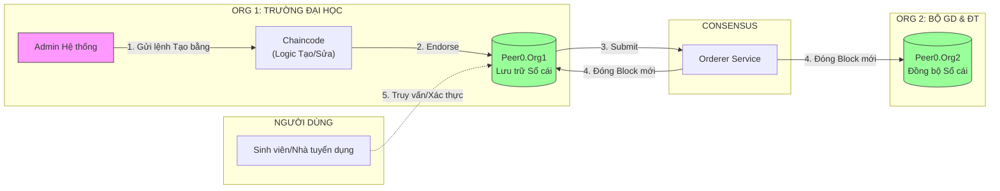

# BÁO CÁO THỰC HIỆN ĐỒ ÁN: XÂY DỰNG MẠNG BLOCKCHAIN XÁC MINH VĂN BẰNG

**Người thực hiện:** [Tên Của Bạn]
**Công nghệ:** Hyperledger Fabric v2.5, CouchDB, Go (Chaincode), Docker.

---

## 1. TỔNG QUAN DỰ ÁN (Overview)

### 1.1. Vấn đề thực tiễn
- Việc quản lý văn bằng chứng chỉ hiện nay còn phân tán, dễ bị làm giả và khó xác minh tức thời.
- Các hệ thống tập trung truyền thống có nguy cơ bị sửa đổi dữ liệu trái phép (Database có thể bị Admin sửa).

### 1.2. Giải pháp đề xuất
Xây dựng mạng lưới Blockchain **Private (Permissioned)** sử dụng **Hyperledger Fabric** để quản lý vòng đời của văn bằng điện tử.
- **Tính bất biến (Immutability):** Dữ liệu khi đã ghi vào Block thì không ai (kể cả Admin) xóa hay sửa được.
- **Tính minh bạch (Transparency):** Các tổ chức trong mạng (Trường, Bộ GD) đều giữ bản sao sổ cái giống hệt nhau.
- **Truy vết (Traceability):** Xem được lịch sử chỉnh sửa, trạng thái (Cấp -> Thu hồi) của từng bằng.

---

## 2. KIẾN TRÚC HỆ THỐNG (Architecture)

Hệ thống được thiết kế với mô hình 2 Tổ chức (Organizations) đảm bảo tính phi tập trung:

| Thành phần | Vai trò | Mô tả |
| :--- | :--- | :--- |
| **Org 1 (Issuer)** | **Trường Đại Học** | Đơn vị cấp phát văn bằng. Giữ Peer và Sổ cái chính. |
| **Org 2 (Auditor)** | **Bộ GD & ĐT** | Đơn vị giám sát. Giữ Peer để đồng bộ dữ liệu (chống chối bỏ), nhưng không tham gia cấp bằng. |
| **Orderer Service** | **Điều phối** | Sắp xếp các giao dịch đóng gói thành Block và phân phát cho các Peer. |
| **CouchDB** | **Cơ sở dữ liệu** | Database trạng thái (World State) hỗ trợ truy vấn phức tạp (tìm theo tên, mã sinh viên...). |
| **Chaincode** | **Smart Contract** | Logic nghiệp vụ (Viết bằng Golang). |

### Sơ đồ luồng dữ liệu (Data Flow)

---

## 3. CÁC CHỨC NĂNG ĐÃ HIỆN THỰC (Key Features)

Tôi đã xây dựng thành công bộ **Smart Contract (Chaincode)** với các nghiệp vụ cốt lõi:

### 3.1. Cấp bằng (CreateCertificate)
- **Logic:** Ghi thông tin sinh viên, xếp loại, ngày cấp vào Blockchain.
- **Bảo mật:** Chỉ danh tính thuộc **Org1 (Trường)** mới được phép gọi hàm này. Org2 gọi sẽ bị từ chối.
- **Kỹ thuật:** Xử lý *Timestamp Determinism* (đồng bộ thời gian) để tránh lỗi lệch dữ liệu giữa các Peer.

### 3.2. Tra cứu nâng cao (Query Certificates)
- **GetCertificate:** Tra cứu theo Mã bằng (ID).
- **GetCertificatesByStudent:** Tra cứu toàn bộ bằng cấp của 1 sinh viên.
    - *Điểm nhấn:* Sử dụng **CouchDB Index** (JSON Query) thay vì LevelDB để hỗ trợ tìm kiếm theo trường dữ liệu bất kỳ.

### 3.3. Thu hồi văn bằng (RevokeCertificate)
- Cho phép Trường đánh dấu bằng là `REVOKED` (ví dụ phát hiện gian lận).
- Dữ liệu cũ không mất đi, chỉ cập nhật trạng thái mới. Lịch sử vẫn còn nguyên.

### 3.4. Truy vết lịch sử (History Trace)
- Xem lại toàn bộ hành trình của văn bằng: *Được tạo lúc nào? Ai tạo? Bị thu hồi lúc nào?*

### 3.5. Bảng Phân Quyền Chi Tiết (Role-Based Access Control)

Hệ thống áp dụng mô hình phân quyền 2 lớp bảo mật:

| Vai trò | Tổ chức | Danh tính Blockchain | Tạo bằng | Thu hồi bằng | Đánh dấu cảnh báo | Xem bằng | Xem tất cả | Xác minh bằng | Xem lịch sử | Thống kê | Quản lý trường | Tìm kiếm nâng cao | Ghi chú |
|:--------|:--------|:---------------------|:---------|:-------------|:------------------|:---------|:-----------|:--------------|:------------|:---------|:---------------|:------------------|:--------|
| **Admin Nhà Trường** | Org1MSP | `admin_hust@org1.example.com` | ✅ (Chỉ trường mình) | ✅ | ❌ | ✅ | ✅ | ✅ | ✅ | ✅ | ❌ | ✅ | Có attribute `universityID` |
| **Super Admin** | Org1MSP | `Admin@org1.example.com` | ✅ (Mọi trường) | ✅ | ❌ | ✅ | ✅ | ✅ | ✅ | ✅ | ❌ | ✅ | Không có attribute |
| **Sinh Viên** | Org1MSP | `User1@org1.example.com` | ❌ | ❌ | ❌ | ✅ | ❌ | ✅ | ✅ | ❌ | ❌ | ❌ | Chỉ đọc |
| **Nhà Tuyển Dụng** | (Ngoài mạng) | Qua API Gateway | ❌ | ❌ | ❌ | ✅ | ❌ | ✅ | ❌ | ❌ | ❌ | ❌ | Truy cập công khai |
| **Admin Bộ GD (Thanh tra)** | Org2MSP | `Admin@org2.example.com` | ❌ | ✅ | ✅ | ✅ | ✅ | ✅ | ✅ | ✅ | ✅ | ✅ | Giám sát & quản lý |

**Giải thích các chức năng:**
- **Tạo bằng:** `CreateCertificate` - Cấp văn bằng mới
  - Admin Trường: Chỉ tạo được bằng của trường mình (kiểm tra attribute `universityID`)
  - Super Admin: Tạo được bằng của mọi trường
- **Thu hồi bằng:** `RevokeCertificate` - Đánh dấu bằng không hợp lệ (Org1 hoặc Org2)
- **Đánh dấu cảnh báo:** `FlagCertificate`, `UnflagCertificate` - Đánh dấu "đang điều tra" (Chỉ Org2)
- **Xem bằng:** `GetCertificate`, `GetCertificatesByStudent` - Tra cứu theo ID hoặc mã sinh viên
- **Xem tất cả:** `GetAllCertificates` - Liệt kê toàn bộ bằng trong hệ thống
- **Xác minh bằng:** `VerifyCertificate` - Kiểm tra bằng có còn hợp lệ không (status = valid)
- **Xem lịch sử:** `GetCertificateHistory` - Xem toàn bộ lịch sử thay đổi của bằng
- **Thống kê:** `GetStatisticsByYear`, `GetStatisticsByIssuer` - Báo cáo số liệu
- **Quản lý trường:** `RegisterUniversity`, `RevokeUniversityLicense` - Quản lý danh sách trường hợp lệ (Chỉ Org2)
- **Tìm kiếm nâng cao:** `SearchCertificates` - Tìm kiếm đa điều kiện

**Giải thích các chức năng:**
- **Tạo bằng:** `CreateCertificate` - Cấp văn bằng mới
- **Thu hồi bằng:** `RevokeCertificate` - Đánh dấu bằng không hợp lệ
- **Xem bằng:** `GetCertificate`, `GetCertificatesByStudent` - Tra cứu theo ID hoặc mã sinh viên
- **Xem tất cả:** `GetAllCertificates` - Liệt kê toàn bộ bằng trong hệ thống
- **Xác minh bằng:** `VerifyCertificate` - Kiểm tra bằng có còn hợp lệ không (status = valid)
- **Xem lịch sử:** `GetCertificateHistory` - Xem toàn bộ lịch sử thay đổi của bằng

**Cơ chế bảo mật:**
- **Lớp 1 (Channel Policy):** Chặn Org2 ngay tại cổng Channel (không cho gửi transaction ghi).
- **Lớp 2 (Chaincode Logic):** Kiểm tra `MSPID` trong code Go, từ chối nếu không phải Org1MSP.

**Kết quả test:**
- ✅ Admin Org1 tạo bằng → `status:200` (Thành công)
- ❌ Admin Org2 cố tạo bằng → `Error: Failed evaluating policy` (Bị chặn)
- ✅ Org2 query dữ liệu → Hiển thị đầy đủ (Chứng minh đồng bộ)

---

## 4. KẾT QUẢ TRIỂN KHAI THỰC TẾ (Implementation Results)

### 4.1. Môi trường triển khai
- Hệ điều hành: Linux (Ubuntu/WSL).
- Nền tảng: Docker Containers.
- Công cụ quản trị: Hyperledger Explorer (Dashboard trực quan).

### 4.2. Kịch bản kiểm thử (Test Scenarios)
Đã thực hiện script kiểm thử tự động (`deploy_network.sh`) thành công 100% với các trường hợp:

1.  **Happy Case:** Admin Trường tạo bằng -> Thành công -> Dữ liệu đồng bộ sang Peer của Bộ ngay lập tức.
2.  **Access Control:** Sinh viên (User1) cố tình tạo bằng -> **Bị chặn (Lỗi Permission)**.
3.  **Data Integrity:** Sửa dữ liệu trong CouchDB -> Blockchain phát hiện Hash không khớp -> Dữ liệu an toàn.

### 4.3. Minh họa kết quả
*(Phần này khi thuyết trình bạn có thể mở terminal hoặc Explorer lên demo)*
- **Block Height:** Đã tạo được X Blocks.
- **Giao dịch:** Đã thực hiện thành công các giao dịch Invoke/Query.
- **Giao diện Explorer:** Hiển thị danh sách Block, Transaction Hash, và chi tiết dữ liệu JSON.

---

## 5. KẾT LUẬN & HƯỚNG PHÁT TRIỂN

### Kết quả đạt được
- Đã xây dựng hoàn chỉnh mạng lõi (Core Network) của một hệ thống Blockchain Private.
- Làm chủ kỹ thuật viết Chaincode (Go) và cấu hình mạng (YAML).
- Kích hoạt thành công database CouchDB cho truy vấn phức tạp.
- Thiết lập phân quyền (RBAC) chặt chẽ giữa các tổ chức.

### Hướng phát triển
- Xây dựng Frontend (Web ReactJS/NextJS) để người dùng thao tác trực quan thay vì dòng lệnh.
- Tích hợp API Gateway (Hyperledger FireFly hoặc Fabric SDK) để kết nối Web App với Blockchain.

---
*Tài liệu này tổng hợp quá trình xây dựng đồ án tính đến ngày 03/02/2026.*
