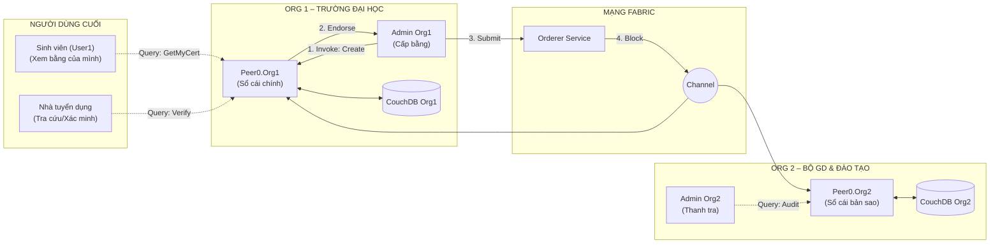

# Hướng Dẫn Kiểm Thử (Test) Mạng Blockchain Hyperledger Fabric

Tài liệu này hướng dẫn chi tiết cách kiểm tra các kịch bản (Scenario) nghiệp vụ của Chaincode Certificate.

## 0. Chuẩn bị (Copy Danh Tính)

Trước khi vào container để test, hãy copy sẵn các bộ chìa khóa (Identity) của các vai trò khác nhau vào container để tiện chuyển đổi.
Chạy lệnh này ở terminal ngoài (WSL):

```bash
cd ~/blockchain/network

# 1. Admin Trường (Org1) - Người có quyền cấp bằng
docker cp organizations/peerOrganizations/org1.example.com/users/Admin@org1.example.com/msp peer0.org1.example.com:/tmp/admin_org1_msp

# 2. Sinh viên (User1 Org1) - Người chỉ được xem bằng
docker cp organizations/peerOrganizations/org1.example.com/users/User1@org1.example.com/msp peer0.org1.example.com:/tmp/user1_org1_msp

# 3. Thanh tra Bộ (Admin Org2) - Người giám sát (Không được cấp bằng)
docker cp organizations/peerOrganizations/org2.example.com/users/Admin@org2.example.com/msp peer0.org1.example.com:/tmp/admin_org2_msp

# 4. Copy file Orderer TLS cho Org2 (để test từ máy Org2)
docker cp organizations/ordererOrganizations/example.com/orderers/orderer.example.com/msp/tlscacerts/tlsca.example.com-cert.pem peer0.org2.example.com:/tmp/orderer.crt
```

---

## 1. Kịch bản: Admin Trường Cấp Bằng (CreateCertificate)

**Vai trò:** Admin Org1  
**Mục tiêu:** Cấp bằng thành công.

```bash
# Vào container Org1
docker exec -it peer0.org1.example.com sh

# Khai báo danh tính Admin Org1
export CORE_PEER_LOCALMSPID="Org1MSP"
export CORE_PEER_MSPCONFIGPATH=/tmp/admin_org1_msp
export CORE_PEER_TLS_ENABLED=true

# Thực hiện tạo bằng
peer chaincode invoke \
  -o orderer.example.com:7050 \
  --ordererTLSHostnameOverride orderer.example.com \
  --tls --cafile /tmp/orderer.crt \
  -C certificatechannel -n certificate \
  --peerAddresses peer0.org1.example.com:7051 --tlsRootCertFiles /etc/hyperledger/fabric/tls/ca.crt \
  -c '{"function":"CreateCertificate","Args":["CERT001","SV101","Nguyen Van A","CNTT","Gioi","2024","Dai Hoc ABC"]}'
```
> **Kết quả:** `status:200` (Thành công) ✅

---

## 2. Kịch bản: Sinh Viên Xem Bằng (Query)

**Vai trò:** User1 Org1  
**Mục tiêu:** Xem được bằng của mình.

```bash
# Vẫn trong container peer0.org1
# Đổi vai: Sinh viên
export CORE_PEER_LOCALMSPID="Org1MSP"
export CORE_PEER_MSPCONFIGPATH=/tmp/user1_org1_msp

# Thực hiện query
peer chaincode query -C certificatechannel -n certificate -c '{"Args":["GetCertificatesByStudent","SV101"]}'
```
> **Kết quả:** Trả về JSON thông tin bằng ✅

---

## 3. Kịch bản: Thanh Tra Bộ Cố Tình Cấp Bằng (Security Test)

**Vai trò:** Admin Org2 (Bộ GD&ĐT)  
**Mục tiêu:** Kiểm tra hệ thống có chặn quyền ghi của Org2 không.

```bash
# Vẫn trong container peer0.org1
# Đổi vai: Thanh tra Bộ (QUAN TRỌNG: Phải khai báo LOCALMSPID)
export CORE_PEER_LOCALMSPID="Org2MSP"
export CORE_PEER_MSPCONFIGPATH=/tmp/admin_org2_msp
export CORE_PEER_TLS_ENABLED=true

# Thực hiện (Cố tình tạo bằng giả)
peer chaincode invoke \
  -o orderer.example.com:7050 \
  --ordererTLSHostnameOverride orderer.example.com \
  --tls --cafile /tmp/orderer.crt \
  -C certificatechannel -n certificate \
  --peerAddresses peer0.org1.example.com:7051 --tlsRootCertFiles /etc/hyperledger/fabric/tls/ca.crt \
  -c '{"function":"CreateCertificate","Args":["FAKE_CERT","FAKE_SV","Hacker","IT","Gioi","2024","Fake Uni"]}'
```
> **Kết quả:** Lỗi `Failed evaluating policy... this policy requires 1 of the 'Writers' sub-policies to be satisfied`  
> **Ý nghĩa:** Org2 bị chặn bởi Channel Policy (Lớp bảo mật cấp 1) ❌ → **Hệ thống bảo mật tốt!** ✅

---

## 4. Kịch bản: Org2 Đọc Dữ Liệu (Data Synchronization Test)

**Vai trò:** Admin Org2  
**Mục tiêu:** Chứng minh dữ liệu đã được đồng bộ sang Org2.

```bash
# Thoát container Org1
exit

# Vào container Org2
docker exec -it peer0.org2.example.com sh
export CORE_PEER_TLS_ENABLED=true

# Query bằng vừa tạo từ Org1
peer chaincode query -C certificatechannel -n certificate -c '{"Args":["GetCertificate","CERT001"]}'
```
> **Kết quả:** Hiển thị đầy đủ JSON thông tin bằng CERT001 ✅  
> **Ý nghĩa:** Dữ liệu đã được đồng bộ hoàn toàn từ Org1 sang Org2!

---

## 5. Kịch bản: Thu Hồi & Xác Minh (Revoke & Verify)

**Vai trò:** Admin Org1 (Quay lại Admin trường để xử lý).

```bash
# Vào lại container Org1
docker exec -it peer0.org1.example.com sh
export CORE_PEER_LOCALMSPID="Org1MSP"
export CORE_PEER_MSPCONFIGPATH=/tmp/admin_org1_msp
export CORE_PEER_TLS_ENABLED=true

# 1. Thu hồi bằng
peer chaincode invoke \
  -o orderer.example.com:7050 \
  --ordererTLSHostnameOverride orderer.example.com \
  --tls --cafile /tmp/orderer.crt \
  -C certificatechannel -n certificate \
  --peerAddresses peer0.org1.example.com:7051 --tlsRootCertFiles /etc/hyperledger/fabric/tls/ca.crt \
  -c '{"function":"RevokeCertificate","Args":["CERT001"]}'

# 2. Kiểm tra lại trạng thái
peer chaincode query -C certificatechannel -n certificate -c '{"Args":["VerifyCertificate","CERT001"]}'
```
> **Kết quả:** Verify trả về `false` (Đã bị thu hồi) ✅

---

## 6. Tóm Tắt Kết Quả Test

| Kịch bản | Vai trò | Hành động | Kết quả mong đợi | Trạng thái |
|:---------|:--------|:----------|:-----------------|:-----------|
| 1 | Admin Org1 | Tạo bằng | `status:200` | ✅ |
| 2 | User1 Org1 | Xem bằng | Hiển thị JSON | ✅ |
| 3 | Admin Org2 | Tạo bằng (Hack) | Lỗi Policy | ✅ |
| 4 | Admin Org2 | Đọc dữ liệu | Hiển thị JSON | ✅ |
| 5 | Admin Org1 | Thu hồi bằng | `status:200` | ✅ |

---

## 7. Sơ Đồ Minh Họa (Mermaid)



---

## 8. Lưu Ý Quan Trọng

1. **Biến `CORE_PEER_LOCALMSPID`:** Bắt buộc phải khai báo khi chuyển đổi giữa các Org, nếu không sẽ bị lỗi "creator org unknown".
2. **Lớp bảo mật 2 tầng:**
   - **Tầng 1:** Channel Policy (Chặn Org2 ở cổng)
   - **Tầng 2:** Chaincode Logic (Kiểm tra MSPID trong code)
3. **Đồng bộ dữ liệu:** Mọi transaction được commit đều tự động đồng bộ sang tất cả Peer trong Channel.
